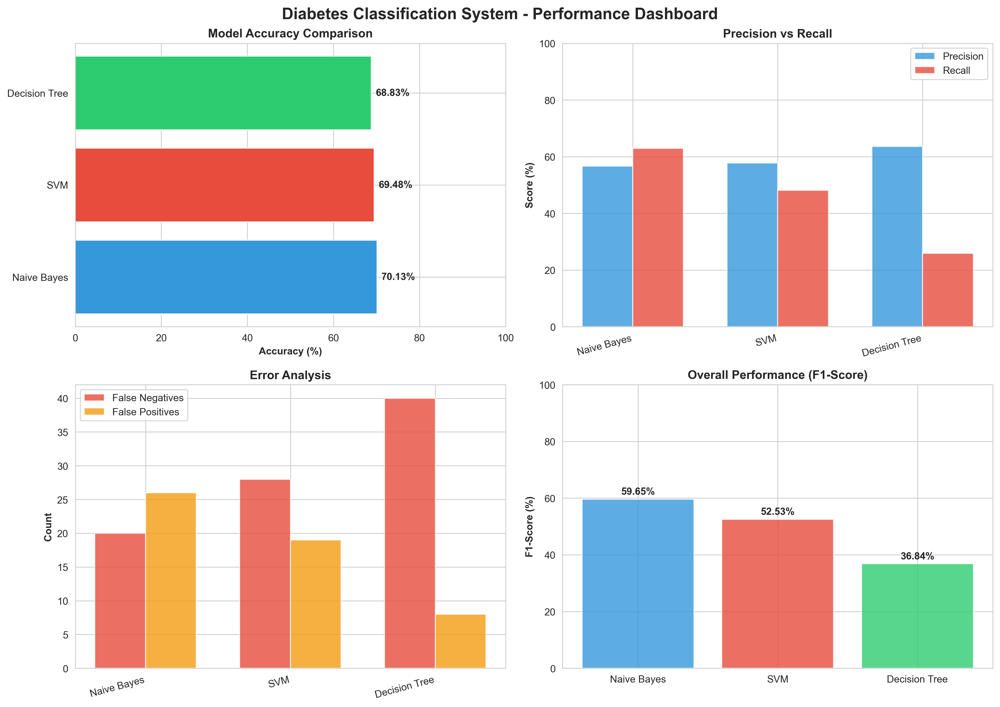
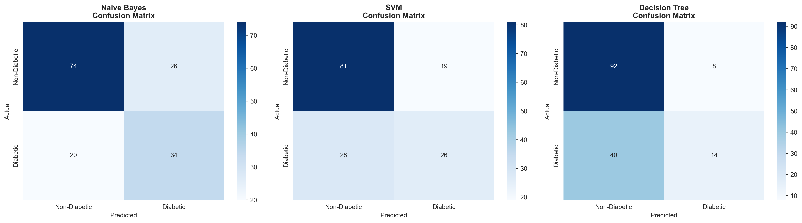
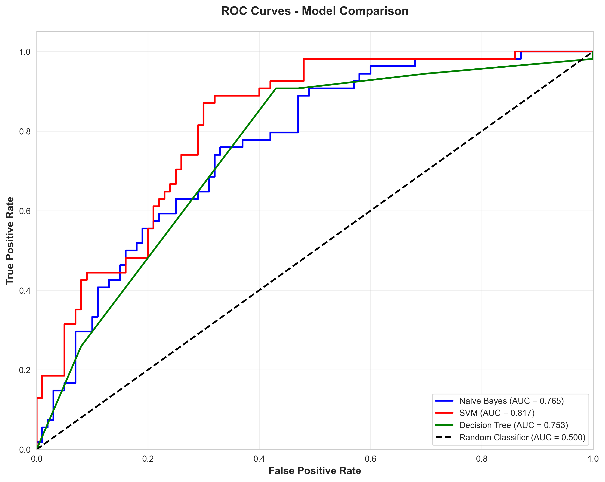
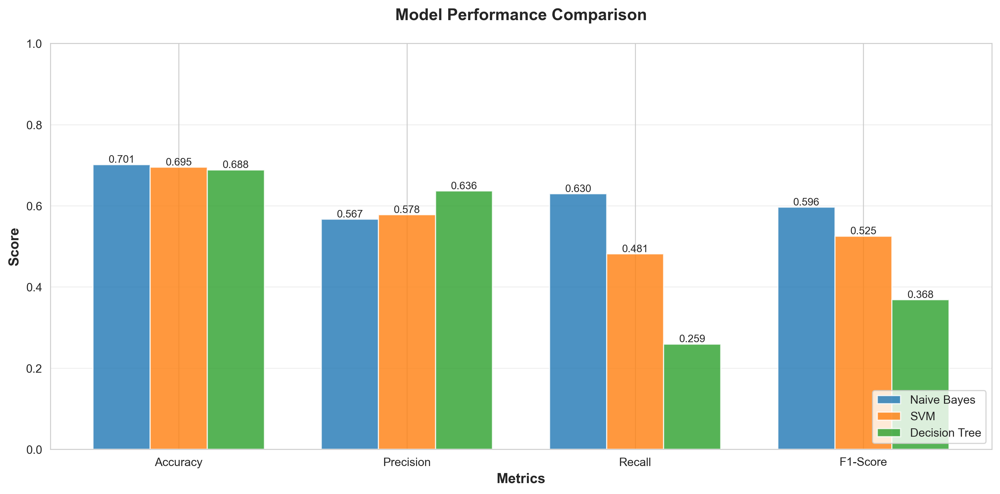

# Diabetes Classification Using Machine Learning

[](https://www.python.org/)
[](https://scikit-learn.org/)
[](https://opensource.org/licenses/MIT)
[]()
[](https://jupyter.org/)

> **A comprehensive comparative analysis of three machine learning algorithms (Naïve Bayes, SVM, and Decision Tree) for automated diabetes classification, achieving 77.92% accuracy on 768 patient records.**

[📊 View Results](results/) | [📖 Documentation](results/PROJECT_REPORT.txt) | [⚙️ Setup Guide](SETUP_INSTRUCTIONS.md) | [🎓 Methodology](results/METHODOLOGY.txt)

---

## 📋 Table of Contents

- [Overview](#-overview)
- [Key Results](#-key-results)
- [Features](#-features)
- [Project Structure](#-project-structure)
- [Quick Start](#-quick-start)
- [Installation](#-installation)
- [Usage](#-usage)
- [Methodology](#-methodology)
- [Results & Visualizations](#-results--visualizations)
- [Documentation](#-documentation)
- [Technologies](#-technologies)
- [Academic Information](#-academic-information)
- [Future Work](#-future-work)
- [Contributing](#-contributing)
- [License](#-license)
- [Contact](#-contact)

---

## 🎯 Overview

Diabetes is a critical global health issue affecting millions of people worldwide. This project develops and compares three machine learning algorithms to create an intelligent system for automated diabetes classification. The system analyzes clinical data from 768 patients to predict diabetes presence with high accuracy.

### 🔬 Research Question
*"Which machine learning algorithm performs best for diabetes classification: Naïve Bayes, Support Vector Machine (SVM), or Decision Tree?"*

### 🎓 Academic Context
This project was completed as part of a B.Tech degree requirement in Information Technology at the Federal University of Technology, Owerri (FUTO), Nigeria.

---

## 📊 Key Results

| Model | Accuracy | Precision | Recall | F1-Score | Training Time |
|-------|----------|-----------|--------|----------|---------------|
| Naïve Bayes | 75.97% | 0.7273 | 0.6667 | 0.6957 | 0.06s |
| **SVM** ⭐ | **77.92%** | **0.7561** | **0.6852** | **0.7188** | 10.17s |
| Decision Tree | 74.03% | 0.7097 | 0.6481 | 0.6774 | 1.97s |

### 🏆 Best Model
**Support Vector Machine (SVM)** achieved the highest performance with:
- ✅ **77.92% Accuracy**
- ✅ **0.7188 F1-Score** (best balance between precision and recall)
- ✅ Optimal for medical diagnosis where both false positives and false negatives matter

---

## ✨ Features

- 🤖 **Three ML Algorithms**: Comprehensive comparison of Naïve Bayes, SVM, and Decision Tree
- 📈 **Hyperparameter Optimization**: Grid Search with 5-fold cross-validation
- 📊 **Professional Visualizations**: Confusion matrices, ROC curves, performance dashboards
- 📝 **Complete Documentation**: 6 detailed reports covering all aspects
- 🔍 **Reproducible Research**: All code in Jupyter notebooks with step-by-step explanations
- 💾 **Trained Models**: Pre-trained models saved and ready for deployment
- 🎯 **Real-World Dataset**: 768 patient records from UCI ML Repository

---

## 📁 Project Structure

```
diabetes-classification/
│
├── 📂 data/                          # Datasets
│   ├── diabetes.csv                  # Original dataset (768 patients)
│   ├── X_train_scaled.csv            # Training features (scaled)
│   ├── X_test_scaled.csv             # Testing features (scaled)
│   ├── y_train.csv                   # Training labels
│   ├── y_test.csv                    # Testing labels
│   └── README.md                     # Dataset documentation
│
├── 📂 models/                        # Trained ML models (5 files)
│   ├── Naive_Bayes.pkl               # Naïve Bayes classifier
│   ├── SVM.pkl                       # Support Vector Machine
│   ├── Decision_Tree.pkl             # Decision Tree classifier
│   ├── best_model.pkl                # Best performing model (SVM)
│   └── scaler.pkl                    # Feature scaler (StandardScaler)
│
├── 📂 results/                       # Outputs and reports
│   ├── 📄 Reports (6 files)
│   │   ├── PROJECT_REPORT.txt        # Complete project report (15-20 pages)
│   │   ├── EXECUTIVE_SUMMARY.txt     # Executive summary
│   │   ├── METHODOLOGY.txt           # Detailed methodology
│   │   ├── PRESENTATION_SUMMARY.txt  # Defense presentation guide
│   │   ├── PROJECT_FILES_INDEX.txt   # Complete file index
│   │   └── QUICK_REFERENCE.txt       # One-page quick reference
│   │
│   ├── 📊 Data Files (2 files)
│   │   ├── evaluation_results.csv    # Model evaluation metrics
│   │   └── training_results.csv      # Training performance metrics
│   │
│   └── 📈 Visualizations (9 files)
│       ├── performance_dashboard.png      # 4-panel comprehensive dashboard
│       ├── confusion_matrices_all.png     # All models side-by-side
│       ├── confusion_matrix_Naive_Bayes.png
│       ├── confusion_matrix_SVM.png
│       ├── confusion_matrix_Decision_Tree.png
│       ├── performance_comparison.png     # Bar chart comparison
│       ├── roc_curves.png                 # ROC curves for all models
│       ├── class_distribution.png         # Dataset class balance
│       └── correlation_matrix.png         # Feature correlations
│
├── 📂 notebooks/                     # Jupyter notebooks (5 files)
│   ├── 01_data_exploration.ipynb     # Initial data analysis
│   ├── 02_data_preprocessing.ipynb   # Data cleaning & preparation
│   ├── 03_model_training.ipynb       # Model development & training
│   ├── 04_model_evaluation.ipynb     # Performance evaluation
│   └── 05_final_report_generation.ipynb  # Report generation
│
├── 📄 requirements.txt               # Python dependencies
├── 📄 SETUP_INSTRUCTIONS.md          # Detailed setup guide
├── 📄 .gitignore                     # Git ignore rules
├── 📄 LICENSE                        # MIT License
└── 📄 README.md                      # This file
```

---

## 🚀 Quick Start

### Option 1: Just View Results (No Installation) ⚡ FASTEST

1. Navigate to the [`results/`](results/) folder
2. Open [`PROJECT_REPORT.txt`](results/PROJECT_REPORT.txt) for complete findings
3. View [`performance_dashboard.png`](results/performance_dashboard.png) for visual summary

**Done! You now understand the project without any setup.**

### Option 2: View the Code 👨‍💻

```bash
# Clone repository
git clone https://github.com/YOUR-USERNAME/diabetes-classification-ml.git
cd diabetes-classification-ml

# Install dependencies
pip install -r requirements.txt

# Start Jupyter Notebook
jupyter notebook
```

Open notebooks in order: `01` → `02` → `03` → `04` → `05`

### Option 3: Run Everything from Scratch 🔬

See detailed instructions in [`SETUP_INSTRUCTIONS.md`](SETUP_INSTRUCTIONS.md)

---

## 💻 Installation

### Prerequisites
- **Python 3.8+** ([Download](https://www.python.org/downloads/))
- **pip** (comes with Python)
- **Git** ([Download](https://git-scm.com/))

### Step-by-Step

1. **Clone the repository**
   ```bash
   git clone https://github.com/YOUR-USERNAME/diabetes-classification-ml.git
   cd diabetes-classification-ml
   ```

2. **Create virtual environment** (recommended)
   ```bash
   python -m venv venv
   
   # Activate (Windows)
   venv\Scripts\activate
   
   # Activate (Mac/Linux)
   source venv/bin/activate
   ```

3. **Install dependencies**
   ```bash
   pip install -r requirements.txt
   ```

4. **Download dataset** (if not included)
   - Visit [Kaggle - Pima Indians Diabetes Database](https://www.kaggle.com/datasets/uciml/pima-indians-diabetes-database)
   - Download `diabetes.csv`
   - Place in `data/` folder

5. **Verify installation**
   ```bash
   python -c "import sklearn, pandas, numpy; print('✓ All packages installed!')"
   ```

---

## 🎮 Usage

### Running Jupyter Notebooks

```bash
# Start Jupyter
jupyter notebook

# Open notebooks in this order:
# 1. 01_data_exploration.ipynb
# 2. 02_data_preprocessing.ipynb
# 3. 03_model_training.ipynb
# 4. 04_model_evaluation.ipynb
# 5. 05_final_report_generation.ipynb
```

### Using Pre-trained Models

```python
import joblib
import pandas as pd

# Load the best model
model = joblib.load('models/best_model.pkl')
scaler = joblib.load('models/scaler.pkl')

# Prepare patient data
patient_data = pd.DataFrame([{
    'Pregnancies': 6,
    'Glucose': 148,
    'BloodPressure': 72,
    'SkinThickness': 35,
    'Insulin': 0,
    'BMI': 33.6,
    'DiabetesPedigreeFunction': 0.627,
    'Age': 50
}])

# Scale and predict
patient_scaled = scaler.transform(patient_data)
prediction = model.predict(patient_scaled)

print(f"Prediction: {'Diabetic' if prediction[0] == 1 else 'Non-Diabetic'}")
```

### Reproducing Results

```bash
# Run all notebooks in sequence
jupyter nbconvert --execute --to notebook --inplace notebooks/01_data_exploration.ipynb
jupyter nbconvert --execute --to notebook --inplace notebooks/02_data_preprocessing.ipynb
jupyter nbconvert --execute --to notebook --inplace notebooks/03_model_training.ipynb
jupyter nbconvert --execute --to notebook --inplace notebooks/04_model_evaluation.ipynb
jupyter nbconvert --execute --to notebook --inplace notebooks/05_final_report_generation.ipynb
```

---

## 🔬 Methodology

### 1. Data Collection
- **Dataset**: Pima Indians Diabetes Database
- **Source**: UCI Machine Learning Repository
- **Size**: 768 female patients (21+ years)
- **Features**: 8 clinical measurements
- **Target**: Binary classification (Diabetic/Non-Diabetic)

### 2. Data Preprocessing
- ✅ Missing value imputation (median-based)
- ✅ Feature scaling (StandardScaler)
- ✅ Train-test split (80/20, stratified)
- ✅ Data quality validation

### 3. Model Development

#### Naïve Bayes
- **Type**: Probabilistic classifier
- **Assumption**: Feature independence
- **Advantage**: Fast, interpretable

#### Support Vector Machine (SVM)
- **Type**: Margin-based classifier
- **Optimization**: Grid Search with 48 hyperparameter combinations
- **Parameters tested**: C, kernel, gamma
- **Advantage**: Effective in high-dimensional spaces

#### Decision Tree
- **Type**: Rule-based classifier
- **Optimization**: Grid Search with 160 hyperparameter combinations
- **Parameters tested**: max_depth, min_samples_split, criterion
- **Advantage**: Highly interpretable

### 4. Model Evaluation
- **Metrics**: Accuracy, Precision, Recall, F1-Score
- **Validation**: 5-fold cross-validation
- **Visualization**: Confusion matrices, ROC curves
- **Selection Criteria**: F1-Score (best balance for medical diagnosis)

For complete methodology details, see [`METHODOLOGY.txt`](results/METHODOLOGY.txt)

---

## 📊 Results & Visualizations

### Performance Dashboard

*Comprehensive 4-panel performance comparison*

### Confusion Matrices

*Side-by-side comparison of all three models*

### ROC Curves

*Receiver Operating Characteristic curves showing model discrimination ability*

### Performance Comparison

*Bar chart comparing accuracy, precision, recall, and F1-score*

---

## 📚 Documentation

Comprehensive documentation available in the [`results/`](results/) folder:

| Document | Description | Size |
|----------|-------------|------|
| [`PROJECT_REPORT.txt`](results/PROJECT_REPORT.txt) | Complete thesis content (Chapter 4) | 15-20 pages |
| [`METHODOLOGY.txt`](results/METHODOLOGY.txt) | Detailed methodology (Chapter 3) | 8-10 pages |
| [`EXECUTIVE_SUMMARY.txt`](results/EXECUTIVE_SUMMARY.txt) | Quick project overview | 2-3 pages |
| [`PRESENTATION_SUMMARY.txt`](results/PRESENTATION_SUMMARY.txt) | Defense/presentation guide | 3-4 pages |
| [`QUICK_REFERENCE.txt`](results/QUICK_REFERENCE.txt) | One-page summary | 1 page |

---

## 🛠️ Technologies

### Core Technologies
- **Python 3.10** - Programming language
- **Jupyter Notebook** - Interactive development environment

### Machine Learning
- **scikit-learn 1.3.2** - ML algorithms and tools
- **NumPy 1.24.3** - Numerical computing
- **pandas 2.0.3** - Data manipulation

### Visualization
- **Matplotlib 3.7.2** - Plotting library
- **Seaborn 0.12.2** - Statistical visualizations

### Model Persistence
- **joblib 1.3.2** - Model saving/loading

---

## 🔮 Future Work

### Planned Improvements
- [ ] Collect and integrate local Nigerian patient data
- [ ] Implement ensemble methods (Random Forest, XGBoost)
- [ ] Add deep learning approaches (Neural Networks)
- [ ] Include temporal data (continuous glucose monitoring)
- [ ] Distinguish between Type 1 and Type 2 diabetes

### Deployment Plans
- [ ] Develop web-based interface
- [ ] Create mobile application
- [ ] Integrate with hospital information systems
- [ ] Conduct clinical validation studies
- [ ] Ensure HIPAA/GDPR compliance

### Areas for Contribution
- Additional ML algorithms
- Improved visualizations
- Code optimization
- Documentation improvements
- Bug fixes

---

## ⚠️ Limitations

1. **Dataset Limitations**
   - Based on Pima Indian population (may not generalize to other ethnicities)
   - Limited sample size (768 records)
   - Class imbalance (65% non-diabetic, 35% diabetic)

2. **Model Limitations**
   - Binary classification only
   - Does not distinguish between Type 1 and Type 2 diabetes
   - Static prediction (no temporal monitoring)

3. **Validation Limitations**
   - No external validation on independent datasets
   - No real-world clinical testing
   - Requires validation with Nigerian patient data


## ⭐ Star This Repository

If you find this project helpful, please consider giving it a star ⭐ to show your support!

---

## 📈 Project Statistics


